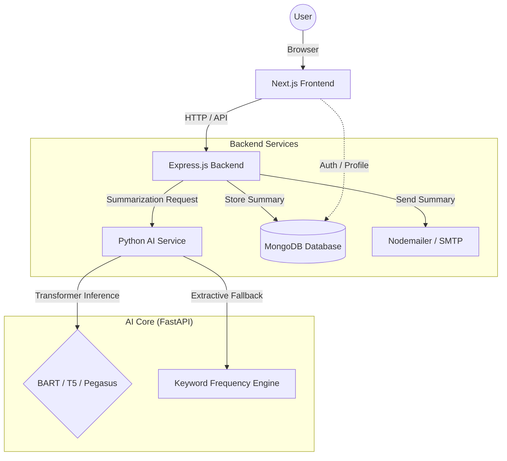
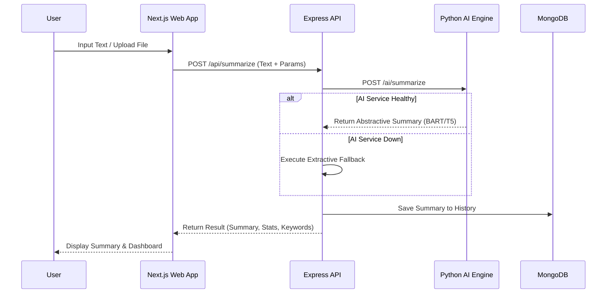
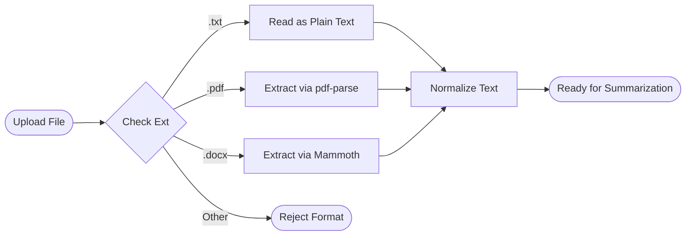
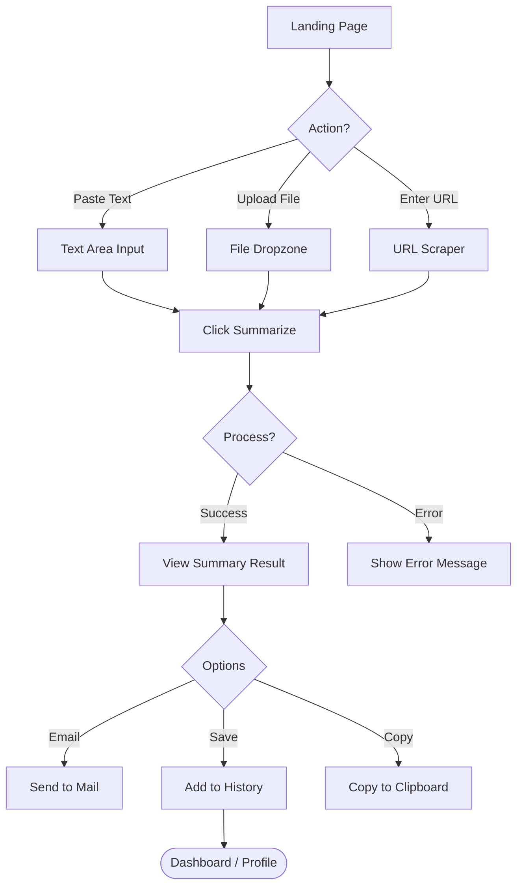
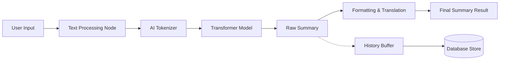

# Project Diagrams & Flowcharts

This document provides a set of visual representations of the **Text Summarization using Transformers** project. These diagrams illustrate the architecture, data flow, and user workflows.

---

## 1. High-Level System Architecture

This diagram shows the core components of the application and how they interact.

---

## 2. Summarization Sequence Diagram

The step-by-step process of a user requesting a summary and receiving the result.

---

## 3. File Upload & Processing Flowchart

Detailed flow for handling various file types and extracting text before summarization.

---

## 4. User Journey Flowchart

The overall experience for a guest or registered user.

---

## 5. Data Flow Diagram (Level 1)

How information flows through the system's internal processes.

